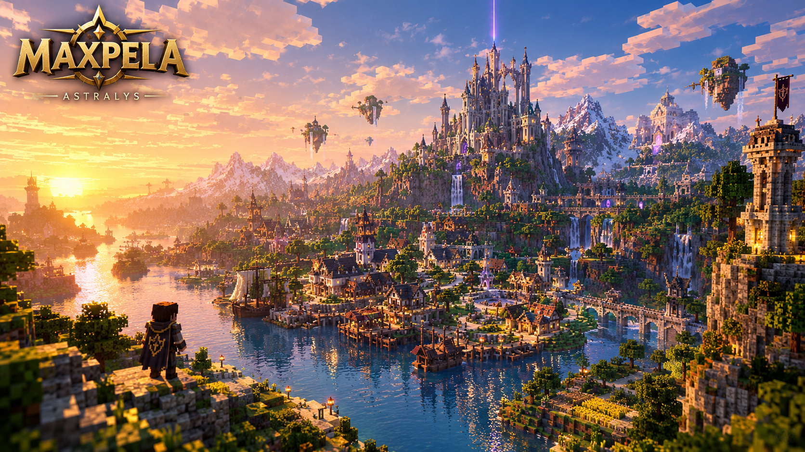

# 🏰 MaxPela

> **Une aventure Minecraft originale entre exploration, donjons, énigmes et légendes oubliées.**

---

## 🌍 À propos de MaxPela

**MaxPela** est un projet d'aventure développé sur **Minecraft Java Edition 1.21.8**.

Le joueur commence son aventure dans le village d'**Astralys**, son village natal.

Au fil de son exploration, il découvrira une ancienne légende racontant l'existence de plusieurs héros ayant autrefois enfermé une terrible menace dans le Nether.

Pour empêcher son retour, les éléments nécessaires à l'ouverture du portail furent séparés et cachés dans plusieurs donjons.

Mais aujourd'hui, certaines traces semblent indiquer que cette histoire pourrait être bien plus réelle qu'une simple légende...

---

# 🎮 L'expérience

MaxPela mélange plusieurs éléments :

- ⚔️ Combats
- 🏰 Donjons
- 🧩 Énigmes
- 🗺️ Exploration
- 🌍 Monde ouvert
- 📖 Narration
- 🧰 Objets spéciaux
- 🏘️ Villages
- 👾 Ennemis et boss
- 🗝️ Secrets
- 🔥 Nether

L'objectif est de proposer une aventure qui conserve l'identité de Minecraft tout en ajoutant une véritable progression narrative.

---

# 🏘️ Astralys

**Astralys** est le village natal du joueur et le point de départ de l'aventure.

Le joueur commence dans une maison du village avant de découvrir progressivement le monde qui l'entoure.

Astralys sert également de point de départ à l'histoire.

C'est ici que le joueur découvrira notamment les premières informations concernant l'ancienne légende.

Le village pourra évoluer au fil de l'aventure et certains habitants pourront réagir aux événements.

> **Bienvenue chez toi.**

---

# 🏰 Les donjons

La première version de MaxPela prévoit **4 donjons principaux**.

Chaque donjon possède :

- sa propre identité ;
- ses propres énigmes ;
- ses propres combats ;
- ses propres mécanismes ;
- une progression unique ;
- une récompense majeure ;
- une Pierre d'Obsidienne.

## 🏚️ Donjon 1 — Vieille Tour de Pierre

Un ancien édifice de pierre dont une partie est visible à la surface.

Le joueur devra progresser dans ses différentes salles et profondeurs.

### Récompense

🏹 **Arc**

---

## 🏰 Donjon 2 — Sanctuaire des Cibles

Un donjon centré sur les mécaniques à distance.

Le joueur devra notamment utiliser :

- 🏹 Flèches
- 🎯 Cibles
- 🔘 Boutons
- 🧩 Déclencheurs

### Récompense

🔒 **À découvrir**

---

## ⛏️ Donjon 3 — Mines Oubliées

Un ancien réseau minier abandonné contenant des secrets et des passages cachés.

Le joueur devra utiliser une capacité permettant d'accéder à certaines zones auparavant inaccessibles.

### Récompense

⛏️ **Pioche spéciale**

---

## 🏰 Donjon 4 — Forteresse des Gardiens

Le dernier grand donjon de la première campagne.

Cette forteresse permettra de préparer la conclusion du premier chapitre de MaxPela.

### Récompense

🔒 **À découvrir**

---

# 🔥 Le Nether

Le Nether occupe une place importante dans l'histoire de MaxPela.

Selon les anciennes légendes, plusieurs héros auraient autrefois enfermé une menace extrêmement dangereuse dans cet autre monde.

Le portail fut ensuite fermé.

Les éléments nécessaires à sa réouverture furent séparés et cachés.

Pendant longtemps, les habitants ont considéré cette histoire comme une simple légende.

Mais le joueur découvrira progressivement que certains éléments du passé pourraient encore exister.

> **Pourquoi le portail avait-il réellement été fermé ?**

---

# 🗺️ Le monde

Le monde de MaxPela est pensé comme un monde ouvert conçu autour de l'exploration.

Les différentes régions auront leur propre identité visuelle, leur histoire et leurs secrets.

### Régions prévues

- 🌲 **Terres Sauvages**
- 🏔️ **Montagnes du Nord**
- 🌾 **Plaine du Levant**
- 🌄 **Vallée Oubliée**
- 🌿 **Marais de l'Est**
- 🌻 **Collines Dorées**
- 🏜️ **Désert des Vents**

Certaines zones pourront être visibles avant d'être réellement accessibles.

Les objets et récompenses obtenus dans les donjons permettront progressivement d'explorer davantage le monde.

---

# 📖 Lore

Une ancienne légende raconte l'existence de plusieurs héros capables de combattre une menace venant d'un autre monde.

Après leur victoire, les héros auraient enfermé cette menace dans le Nether.

Pour empêcher son retour, les éléments nécessaires à l'ouverture du portail furent séparés et cachés.

Des lieux anciens furent construits afin de protéger ces éléments.

Des générations plus tard, presque personne ne croit encore à cette histoire.

Mais certaines ruines, certains livres et certains événements semblent raconter une autre version de l'histoire.

Le joueur devra découvrir la vérité.

---

# ⚔️ Progression

La progression de MaxPela repose notamment sur l'exploration et les objets obtenus au cours de l'aventure.

Certains objets permettent d'accéder à des endroits auparavant inaccessibles.

La progression du joueur est donc liée à :

- 🏰 Donjons
- 🧰 Objets spéciaux
- 🗺️ Exploration
- 🧩 Énigmes
- 📜 Quêtes
- 📖 Histoire

---

# 📊 État du projet

> 🟡 **Développement actif**

| Fonctionnalité | État |
|---|---|
| Vision du projet | 🟢 Terminé |
| Bible du projet | 🟡 En cours |
| Lore principal | 🟡 En cours |
| Chronologie | 🟡 En cours |
| Astralys | 🟡 En développement |
| Monde | 🟡 En développement |
| Carte globale | 🟡 En préparation |
| Donjon 1 | 🟡 En développement |
| Donjon 2 | 🟡 En développement |
| Donjon 3 | ⚪ À venir |
| Donjon 4 | ⚪ À venir |
| Système de quêtes | 🟡 En développement |
| Système de progression | 🟡 En développement |
| Combat | 🟡 En développement |
| Tests internes | ⚪ À venir |
| Alpha | ⚪ À venir |
| Beta | ⚪ À venir |

---

# 🎮 Informations techniques

### Version Minecraft

**Minecraft Java Edition 1.21.8**

### Type de projet

**Aventure / RPG / Exploration**

### Mode principal

**Solo**

La coopération multijoueur pourra être envisagée dans une future version.

---

# 📥 Installation

Les instructions d'installation seront publiées avec la première version jouable de MaxPela.

## Pré-requis

- Minecraft Java Edition 1.21.8
- Les fichiers officiels de MaxPela
- Les éventuels mods requis
- Les éventuels shaders recommandés

## Installation

1. Installer Minecraft Java Edition 1.21.8.
2. Télécharger la version officielle de MaxPela.
3. Installer les éventuels mods nécessaires.
4. Installer les éventuels shaders recommandés.
5. Installer la carte.
6. Lancer Minecraft.
7. Charger le monde MaxPela.
8. Commencer l'aventure à Astralys.

> ⚠️ Les instructions pourront évoluer avec les versions du projet.

---

# 🧪 Tests

MaxPela sera progressivement testé par la communauté.

Les testeurs pourront notamment vérifier :

- 🏰 Les donjons
- 🧩 Les énigmes
- ⚔️ Les combats
- 🗺️ L'exploration
- 🐞 Les bugs
- 📖 La compréhension de l'histoire
- ⚙️ Les systèmes techniques

Les retours des joueurs pourront permettre d'améliorer le projet avant sa sortie.

---

# 🐞 Signaler un bug

Si vous découvrez un problème, merci de fournir autant d'informations que possible.

### Exemple

**Version :**

**Zone :**

**Description :**

**Étapes pour reproduire :**

1. 
2. 
3.

**Résultat attendu :**

**Résultat obtenu :**

**Capture / vidéo :**

---

# 💡 Contributions

Les idées de la communauté sont les bienvenues.

Vous pouvez proposer des idées concernant :

- 🏰 Les donjons
- 🧩 Les énigmes
- ⚔️ Le combat
- 🗺️ L'exploration
- 📖 Le lore
- 🏘️ Les villages
- 👾 Les ennemis
- 🐉 Les boss
- 🎮 Le gameplay

Toutes les propositions peuvent être étudiées.

Cependant, une proposition n'implique pas automatiquement son intégration dans le jeu.

---

# 💬 Communauté

La communauté officielle de MaxPela se trouve sur Discord.

### 🏰 Discord officiel

👉 **https://discord.gg/DdwspU7JdT**

Vous pourrez y retrouver :

- 📢 Les annonces
- 📰 Les devlogs
- 🗺️ La roadmap
- 📖 Le lore
- 🧩 Les théories
- 🧪 Les tests
- 🐞 Les bugs
- 💡 Les idées de la communauté
- 🎨 Les créations des joueurs
- 💬 Les discussions

---

# 📰 Développement

Le développement de MaxPela sera documenté progressivement.

Les devlogs pourront présenter :

- 🏗️ Les constructions
- 🗺️ La création du monde
- 🏰 Les donjons
- ⚙️ Les systèmes techniques
- 🧩 Les énigmes
- 📖 Le développement du lore
- 🎨 Les ressources visuelles
- 🧪 Les tests

---

# 🛣️ Roadmap

## 🌱 Fondations

- 🟢 Vision du projet
- 🟢 Concept général
- 🟡 Bible du projet
- 🟡 Lore
- 🟡 Chronologie

## 🗺️ Monde

- 🟡 Carte globale
- 🟡 Astralys
- 🟡 Régions
- ⚪ Points d'intérêt
- ⚪ Secrets

## 🏰 Contenu

- 🟡 Donjon 1
- 🟡 Donjon 2
- ⚪ Donjon 3
- ⚪ Donjon 4

## ⚙️ Systèmes

- 🟡 Quêtes
- 🟡 Progression
- 🟡 Combat
- 🟡 Économie
- ⚪ Carte
- ⚪ Cinématiques

## 🧪 Tests

- ⚪ Tests internes
- ⚪ Alpha
- ⚪ Beta
- ⚪ Version finale

---

# 🎬 Médias

Les captures d'écran, vidéos, bandes-annonces et autres médias du projet seront progressivement publiés.

---

# 👥 Équipe

## MaxPela Studios

**MaxPela** est développé par une équipe indépendante.

Les membres de l'équipe participent notamment à :

- 🧠 Game Design
- 🏗️ Construction
- ⚙️ Développement
- 📖 Écriture
- 🗺️ World Design
- 🧪 Tests
- 🎨 Direction artistique

Les crédits détaillés seront ajoutés au fur et à mesure du développement.

---

# 📜 Licence & utilisation

MaxPela est un projet indépendant en développement.

Les fichiers, ressources, textes, concepts, cartes et autres contenus du projet ne peuvent pas être redistribués, modifiés ou réutilisés publiquement sans l'autorisation de l'équipe MaxPela.

Minecraft est une marque de Mojang Studios / Microsoft.

MaxPela n'est pas un produit officiel de Mojang Studios.

---

# ❤️ Merci

Merci à toutes les personnes qui suivent le développement de MaxPela.

Merci aux joueurs, testeurs, créateurs, contributeurs et membres de la communauté qui participeront à l'aventure.

---

# 🏰 MAXPELA

> **Une ancienne légende.**
>
> **Quatre donjons.**
>
> **Quatre Pierres d'Obsidienne.**
>
> **Un portail oublié.**
>
> **Et une aventure qui ne fait que commencer.**

🌄 **Bienvenue à Astralys.**
